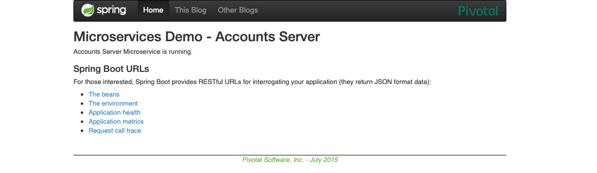
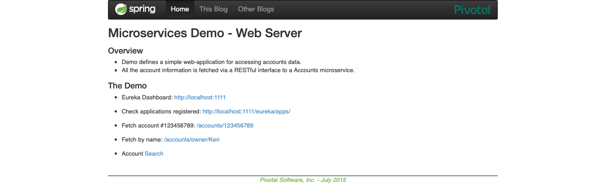
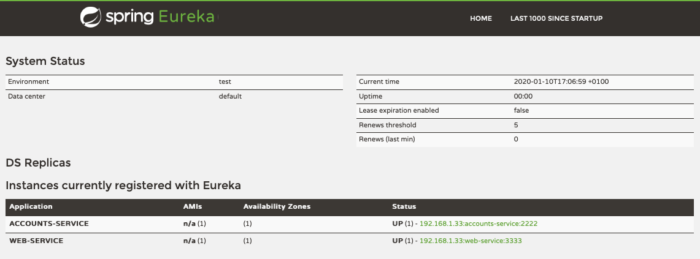
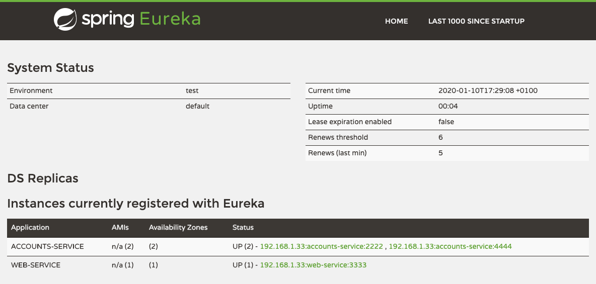
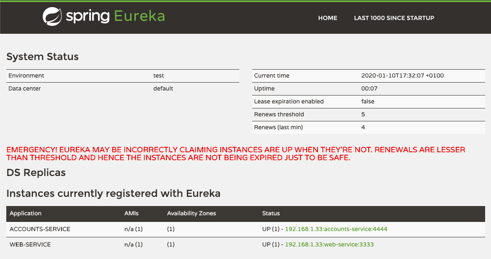
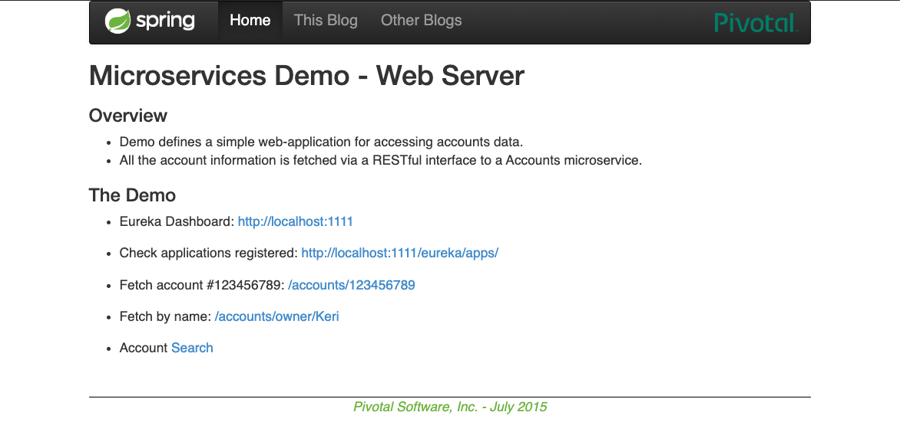
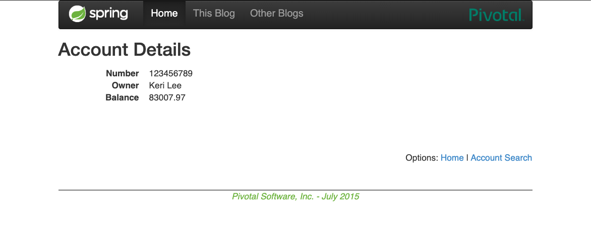

# lab6-microservices

Author: Javier Martínez Fernández (737910@unizar.es)


## 1. The two microservices are running and registered
First, Eureka and the 2 microservices are launched. To show that the latter two are running and have been registered, traces and and screenshots of both are shown.

### Accounts microservice

##### Trace

```
2020-01-10 17:25:15.668  INFO 6100 --- [           main] c.n.discovery.InstanceInfoReplicator     : InstanceInfoReplicator onDemand update allowed rate per min is 4
2020-01-10 17:25:15.675  INFO 6100 --- [           main] com.netflix.discovery.DiscoveryClient    : Discovery Client initialized at timestamp 1578673515672 with initial instances count: 0
2020-01-10 17:25:15.680  INFO 6100 --- [           main] o.s.c.n.e.s.EurekaServiceRegistry        : Registering application ACCOUNTS-SERVICE with eureka with status UP
2020-01-10 17:25:15.681  INFO 6100 --- [           main] com.netflix.discovery.DiscoveryClient    : Saw local status change event StatusChangeEvent [timestamp=1578673515681, current=UP, previous=STARTING]
2020-01-10 17:25:15.683  INFO 6100 --- [nfoReplicator-0] com.netflix.discovery.DiscoveryClient    : DiscoveryClient_ACCOUNTS-SERVICE/192.168.1.33:accounts-service:2222: registering service...
2020-01-10 17:25:15.850  INFO 6100 --- [nfoReplicator-0] com.netflix.discovery.DiscoveryClient    : DiscoveryClient_ACCOUNTS-SERVICE/192.168.1.33:accounts-service:2222 - registration status: 204
2020-01-10 17:25:15.867  INFO 6100 --- [           main] o.s.b.w.embedded.tomcat.TomcatWebServer  : Tomcat started on port(s): 2222 (http) with context path ''
2020-01-10 17:25:15.869  INFO 6100 --- [           main] .s.c.n.e.s.EurekaAutoServiceRegistration : Updating port to 2222
2020-01-10 17:25:15.872  INFO 6100 --- [           main] accounts.AccountsServer                  : Started AccountsServer in 13.975 seconds (JVM running for 14.851)
 ```

##### Web screenshot




### Web microservice

##### Trace

```
2020-01-10 17:25:17.780  INFO 6102 --- [           main] com.netflix.discovery.DiscoveryClient    : Discovery Client initialized at timestamp 1578673517776 with initial instances count: 0
2020-01-10 17:25:17.789  INFO 6102 --- [           main] o.s.c.n.e.s.EurekaServiceRegistry        : Registering application WEB-SERVICE with eureka with status UP
2020-01-10 17:25:17.790  INFO 6102 --- [           main] com.netflix.discovery.DiscoveryClient    : Saw local status change event StatusChangeEvent [timestamp=1578673517790, current=UP, previous=STARTING]
2020-01-10 17:25:17.797  INFO 6102 --- [nfoReplicator-0] com.netflix.discovery.DiscoveryClient    : DiscoveryClient_WEB-SERVICE/192.168.1.33:web-service:3333: registering service...
2020-01-10 17:25:17.868  INFO 6102 --- [           main] o.s.b.w.embedded.tomcat.TomcatWebServer  : Tomcat started on port(s): 3333 (http) with context path ''
2020-01-10 17:25:17.870  INFO 6102 --- [           main] .s.c.n.e.s.EurekaAutoServiceRegistration : Updating port to 3333
2020-01-10 17:25:17.875  INFO 6102 --- [           main] web.WebServer                            : Started WebServer in 8.42 seconds (JVM running for 10.112)
 ```

##### Web screenshot




## 2. The service registration service has the two microservices registered

Below is a trace and screenshots of the Eureka dashboard showing that Eureka is alive and has the two microservices registered.

##### Trace


```
2020-01-10 17:25:15.666  INFO 24416 --- [      Thread-10] c.n.e.r.PeerAwareInstanceRegistryImpl    : Changing status to UP
2020-01-10 17:25:15.674  INFO 24416 --- [      Thread-10] e.s.EurekaServerInitializerConfiguration : Started Eureka Server
2020-01-10 17:25:15.680  INFO 24416 --- [           main] o.s.b.w.embedded.tomcat.TomcatWebServer  : Tomcat started on port(s): 1111 (http) with context path ''
2020-01-10 17:25:15.681  INFO 24416 --- [           main] .s.c.n.e.s.EurekaAutoServiceRegistration : Updating port to 1111
2020-01-10 17:25:15.686  INFO 24416 --- [           main] registration.RegistrationServer          : Started RegistrationServer in 8.228 seconds (JVM running for 8.571)
2020-01-10 17:25:15.850  INFO 24416 --- [a-EvictionTimer] c.n.e.registry.AbstractInstanceRegistry  : Running the evict task with compensationTime 0ms
```

```
2020-01-10 17:25:15.260  INFO 6097 --- [a-EvictionTimer] c.n.e.registry.AbstractInstanceRegistry  : Running the evict task with compensationTime 0ms
2020-01-10 17:25:15.847  INFO 6097 --- [nio-1111-exec-3] c.n.e.registry.AbstractInstanceRegistry  : Registered instance ACCOUNTS-SERVICE/192.168.1.33:accounts-service:2222 with status UP (replication=false)
2020-01-10 17:25:16.260  INFO 6097 --- [a-EvictionTimer] c.n.e.registry.AbstractInstanceRegistry  : Running the evict task with compensationTime 0ms
```

```
2020-01-10 17:25:17.261  INFO 6097 --- [a-EvictionTimer] c.n.e.registry.AbstractInstanceRegistry  : Running the evict task with compensationTime 0ms
2020-01-10 17:25:17.908  INFO 6097 --- [nio-1111-exec-5] c.n.e.registry.AbstractInstanceRegistry  : Registered instance WEB-SERVICE/192.168.1.33:web-service:3333 with status UP (replication=false)
2020-01-10 17:25:18.262  INFO 6097 --- [a-EvictionTimer] c.n.e.registry.AbstractInstanceRegistry  : Running the evict task with compensationTime 0ms
 ```

##### Web screenshot




## 3. A second account microservice is running in the port 4444 and it is registered

To launch a second accounts microservice, the file ```/accounts/src/main/resources/application.yml ``` is modified, changing the Tomcat HTTP port to 4444. This is done while the other microservice, previously launched, is still running. 

A second instance of the accounts microservice is launched.

##### Trace

###### Second accounts microservice


```
2020-01-10 17:27:49.376  INFO 6144 --- [           main] com.netflix.discovery.DiscoveryClient    : Discovery Client initialized at timestamp 1578673669374 with initial instances count: 2
2020-01-10 17:27:49.378  INFO 6144 --- [           main] o.s.c.n.e.s.EurekaServiceRegistry        : Registering application ACCOUNTS-SERVICE with eureka with status UP
2020-01-10 17:27:49.379  INFO 6144 --- [           main] com.netflix.discovery.DiscoveryClient    : Saw local status change event StatusChangeEvent [timestamp=1578673669379, current=UP, previous=STARTING]
2020-01-10 17:27:49.422  INFO 6144 --- [nfoReplicator-0] com.netflix.discovery.DiscoveryClient    : DiscoveryClient_ACCOUNTS-SERVICE/192.168.1.33:accounts-service:4444: registering service...
2020-01-10 17:27:49.472  INFO 6144 --- [nfoReplicator-0] com.netflix.discovery.DiscoveryClient    : DiscoveryClient_ACCOUNTS-SERVICE/192.168.1.33:accounts-service:4444 - registration status: 204
2020-01-10 17:27:49.530  INFO 6144 --- [           main] o.s.b.w.embedded.tomcat.TomcatWebServer  : Tomcat started on port(s): 4444 (http) with context path ''
2020-01-10 17:27:49.531  INFO 6144 --- [           main] .s.c.n.e.s.EurekaAutoServiceRegistration : Updating port to 4444
2020-01-10 17:27:49.535  INFO 6144 --- [           main] accounts.AccountsServer                  : Started AccountsServer in 14.005 seconds (JVM running for 15.262)
 ```

###### Eureka

```
2020-01-10 17:27:48.654  INFO 6097 --- [a-EvictionTimer] c.n.e.registry.AbstractInstanceRegistry  : Running the evict task with compensationTime 5ms
2020-01-10 17:27:49.470  INFO 6097 --- [nio-1111-exec-6] c.n.e.registry.AbstractInstanceRegistry  : Registered instance ACCOUNTS-SERVICE/192.168.1.33:accounts-service:4444 with status UP (replication=false)
2020-01-10 17:27:49.655  INFO 6097 --- [a-EvictionTimer] c.n.e.registry.AbstractInstanceRegistry  : Running the evict task with compensationTime 0ms
 ```


##### Web screenshot




## 4. Killing the microservice with port 2222

The microservice located at port 2222 is then killed. It's cancelled at the Eureka Registry Service and is no longer registered.

##### Trace

```
2020-01-10 17:30:59.141  INFO 6097 --- [a-EvictionTimer] c.n.e.registry.AbstractInstanceRegistry  : Running the evict task with compensationTime 0ms
2020-01-10 17:30:59.295  INFO 6097 --- [nio-1111-exec-2] c.n.e.registry.AbstractInstanceRegistry  : Cancelled instance ACCOUNTS-SERVICE/192.168.1.33:accounts-service:2222 (replication=false)
2020-01-10 17:31:00.145  INFO 6097 --- [a-EvictionTimer] c.n.e.registry.AbstractInstanceRegistry  : Running the evict task with compensationTime 3ms
 ```

##### Web screenshot




Because another instance of the account microservice has been registered on port 4444, the web service can still access the accounts, since they are stored in a replicated database that has not changed, 
as can be seen in ```accounts/src/main/resources/testdb/data.sql ```.


##### Trace

```
2020-01-10 17:35:25.168  INFO 6144 --- [nio-4444-exec-8] accounts.web.AccountsController          : accounts-service byNumber() found: 123456789 [Keri Lee]: $83007.97
 ```

##### Web screenshot






